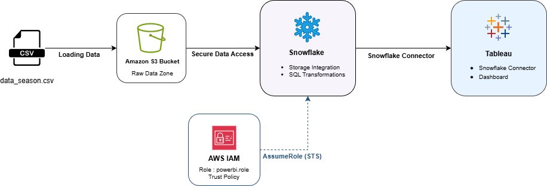
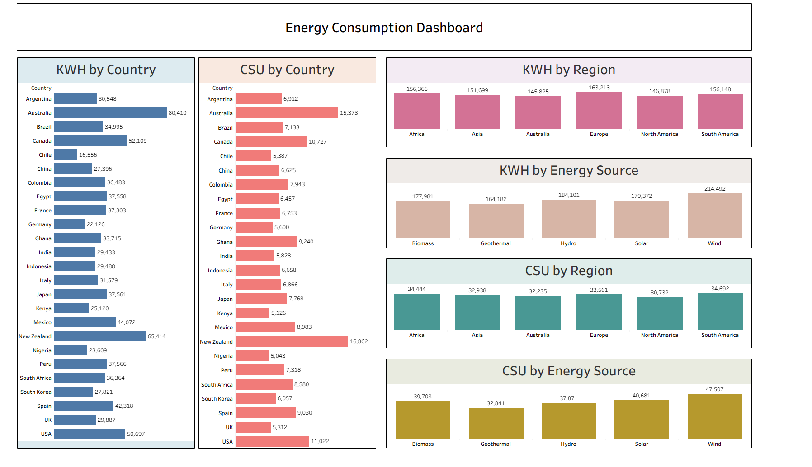

# AWS-Snowflake-Tableau Project

## Overview

This project demonstrates a robust end-to-end data engineering pipeline that integrates **AWS S3** for data lake storage, **Snowflake** for data warehousing and transformation, and **Tableau** for advanced analytics and visualization. The pipeline automates data ingestion using Snowpipe and provides scalable, secure access to business insights.

## Tech Stack

* **Cloud Storage**: Amazon Web Services (AWS) S3
* **Data Warehouse**: Snowflake
* **Visualization**: Tableau
* **Orchestration**: Snowflake Snowpipe
* **Languages**: SQL

## Project Structure

```bash
AWS-Snowflake-Tableau-Project/
├── aws/                # AWS Configuration and IAM policies
├── data/               # Raw source data 
│   ├── curated/        # Contains CSV files generated after SQL-based data transformation performed in Snowflake.
│   └── raw/            # Contains raw CSV files downloaded from the source.
├── images/             # Documentation images and screenshots
├── snowflake/          # Snowflake SQL scripts (DDL, Stages, Pipes)
├── tableau/            # Tableau Workbooks (.twb/.twbx)
└── README.md           # Project Documentation
```

## Architecture

The system architecture follows a modern ELT (Extract, Load, Transform) pattern:

1. **Extract**: Raw data is ingested into an AWS S3 bucket.
2. **Load**: Snowflake's Snowpipe automatically detects new files in S3 and loads them into a staging area.
3. **Transform**: Data is moved from staging to analytical tables within Snowflake.
4. **Visualize**: Tableau connects directly to Snowflake to query and visualize the data in near real-time.

## Pipeline Flow



## Security Considerations

* **AWS IAM Policies**: Restricted policies (`s3:GetObject`, `s3:ListBucket`) ensure Snowflake only accesses specific buckets.
* **Snowflake Storage Integration**: Uses secure IAM role-based authentication instead of access keys.
* **Network Policies**: ( Optional) Restricting access to Snowflake based on IP allowlisting.
* **Tableau Security**: Secure connection using Snowflake credentials with row-level security capabilities.

## Tableau Dashboard Pics



## Prerequisites

* **AWS Account**: For S3 bucket creation and IAM management.
* **Snowflake Account**: For data warehousing (free trial works).
* **Tableau Desktop / Public**: For creating visualizations.
* **SnowSQL** (Optional): For command-line execution.

* ## Status

🚧 Project in progress – Snowflake transformations and Tableau dashboards under development.
